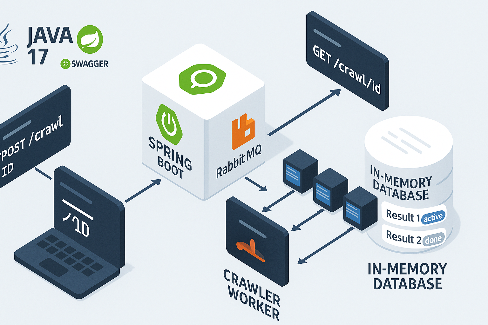

# Web Crawler API - Desafio Java Axur

**Desenvolvedor:** Christian Vladimir Uhdre Mulato  
**Data:** Campo Largo, PR, 09 de Julho de 2025  
**Para:** Axur - Teste Técnico Desenvolvedor Java Sênior

## Diagrama



## Descrição

Aplicação Java para navegar por um website em busca de um termo fornecido pelo usuário e listar as URLs onde o termo foi
encontrado. Desenvolvida como solução completa para o teste técnico de Backend Developer, implementando todos os
requisitos com arquitetura robusta e processamento assíncrono via RabbitMQ.

## Requisitos Atendidos

### 1. API HTTP

A aplicação fornece uma API HTTP na porta 4567 com os seguintes endpoints:

**POST /crawl**: Inicia uma nova busca por um termo

```http
POST /crawl HTTP/1.1
Host: localhost:4567
Content-Type: application/json
Body: {"keyword": "security"}

Resposta:
200 OK
Content-Type: application/json
Body: {"id": "30vbllyb"}
```

**GET /crawl/{id}**: Consulta resultados de busca

```http
GET /crawl/30vbllyb HTTP/1.1
Host: localhost:4567

Resposta:
200 OK
Content-Type: application/json
{
  "id": "30vbllyb",
  "status": "active",
  "urls": [
    "http://hiring.axreng.com/index2.html",
    "http://hiring.axreng.com/htmlman1/chcon.1.html"
  ]
}
```

### 2. Validação do Termo

- Mínimo de 4 e máximo de 32 caracteres
- Busca case insensitive em qualquer parte do conteúdo HTML (incluindo tags e comentários)
- Implementação validada por testes unitários específicos

### 3. ID da Busca

- Código alfanumérico de 8 caracteres gerado automaticamente
- Único para cada busca
- Implementado através de classe dedicada para geração de IDs

### 4. URL Base

- Configurada via variável de ambiente (BASE_URL)
- Implementação segue apenas links (absolutos e relativos) da mesma base URL
- Validação completa de URLs para garantir segurança e conformidade

### 5. Múltiplas Buscas Simultâneas

- Suporte para execução de múltiplas buscas em paralelo
- Informações sobre buscas ativas e concluídas são mantidas durante a execução
- Implementado através de processamento assíncrono

### 6. Resultados Parciais

- Durante uma busca em andamento, os resultados já encontrados são disponibilizados
- Status da busca ("active" ou "done") é atualizado conforme progresso
- Implementação testada para garantir disponibilidade dos resultados parciais

### 7. Estrutura do Projeto

- Respeitada a estrutura base fornecida
- Dockerfile e pom.xml mantidos sem modificações
- Código organizado em pacotes seguindo boas práticas

### 8. Compilação e Execução

Compilação e execução conforme especificado:

```bash
docker build . -t axreng/backend
docker run -e BASE_URL=http://hiring.axreng.com/ -p 4567:4567 --rm axreng/backend
```

## Testes Automatizados

A aplicação conta com testes completos para validar todos os requisitos:

```markdown
|------------------------|-----------------------------------------------------|
| Requisito              | Classe de Teste                                     |
|------------------------|-----------------------------------------------------|
| 1. API HTTP            | ApiHttpControllerTest, ConformidadeDesafioTest      |
| 2. Validação do termo  | HtmlContentSearchTest                               |
| 3. ID da busca         | IdGeneratorServiceTest                              |
| 4. URL base            | BaseUrlConfigurationTest, WebCrawlerSameBaseUrlTest |
| 5. Múltiplas buscas    | MultipleCrawlsTest                                  |
| 6. Resultados parciais | PartialResultsTest                                  |
|------------------------|-----------------------------------------------------|
```

## Tecnologias Utilizadas

- **Java 17** - Linguagem de programação principal
- **Spring Boot 3.x** - Framework para desenvolvimento de aplicações Java
- **Spring Data JPA** - Abstração para acesso a dados
- **H2 Database** - Banco de dados em memória para desenvolvimento
- **RabbitMQ** - Message broker para processamento assíncrono
- **Spring AMQP** - Integração com RabbitMQ
- **JSoup** - Biblioteca para parsing e manipulação de HTML
- **JUnit 5** - Framework para testes automatizados
- **Mockito** - Framework para mocking em testes
- **SpringDoc OpenAPI** - Documentação automática da API (Swagger)
- **Docker** - Containerização da aplicação
- **Maven** - Gerenciamento de dependências e build

## Funcionalidades Implementadas

### **API REST Completa**

- Endpoints POST /crawl e GET /crawl/{id}
- Validação de entrada com Bean Validation
- Tratamento global de exceções
- Documentação automática com Swagger/OpenAPI

### **Web Crawling Inteligente**

- Busca case-insensitive em todo o conteúdo HTML
- Seguimento de links absolutos e relativos da mesma base URL
- Controle de URLs visitadas para evitar loops infinitos
- Parsing eficiente com JSoup

### **Processamento Assíncrono**

- Filas RabbitMQ para desacoplamento
- Múltiplas buscas simultâneas independentes
- Resultados parciais disponíveis em tempo real
- Status de progresso atualizado dinamicamente

### **Robustez e Confiabilidade**

- Validação rigorosa de URLs e parâmetros
- Tratamento de erros HTTP e timeouts
- Logs estruturados para auditoria
- Retry automático em falhas de comunicação

### **Monitoramento e Observabilidade**

- Spring Boot Actuator para health checks
- Métricas de performance e uso
- Logs detalhados de todas as operações
- Interface de gerenciamento RabbitMQ

## Execução do Projeto

```bash
# Build da aplicação
docker build . -t axreng/backend

# Execução
docker run -e BASE_URL=http://hiring.axreng.com/ -p 4567:4567 --rm axreng/backend
```

## Arquitetura

A aplicação segue uma arquitetura de camadas:

1. Controller: Endpoints REST da API
2. Service: Lógica de negócio e gerenciamento de crawling
3. Repository: Persistência de dados
4. Model/Entity: Objetos de domínio e entidades de banco
5. Listener: Processamento assíncrono de mensagens

## Documentação Completa

Para informações detalhadas sobre cada aspecto do projeto, consulte:

- **[docs/INDEX.md](docs/INDEX.md)** - Índice completo da documentação técnica
- **[docs/RABBITMQ.md](docs/RABBITMQ.md)** - Explicação técnica do uso do RabbitMQ na arquitetura
- **[docs/DATABASE.md](docs/DATABASE.md)** - Estrutura do banco de dados e massa de dados
- **[docs/SWAGGER-API.md](docs/SWAGGER-API.md)** - Documentação completa da API REST
- **[docs/DOCKER-COMPOSE.md](docs/DOCKER-COMPOSE.md)** - Guia para execução via Docker Compose

## Execução Local (Desenvolvimento)

### Pré-requisitos

- Java 17+
- Maven 3.6+
- Docker e Docker Compose

### Passos para Execução

1. **Iniciar RabbitMQ:**
2. 
   ```bash
   docker-compose up -d rabbitmq
   ```

3. **Executar aplicação:**
4. 
   ```bash
   mvn spring-boot:run
   ```

5. **Acessar aplicação:**
   - API: [http://localhost:4567](http://localhost:4567)
   - Swagger: [http://localhost:4567/swagger-ui.html](http://localhost:4567/swagger-ui.html)
   - RabbitMQ Management: [http://localhost:15672](http://localhost:15672) (guest/guest)

## Execução Containerizada (Produção)

Conforme especificado no desafio:

```bash
docker build . -t axreng/backend
docker run -e BASE_URL=http://hiring.axreng.com/ -p 4567:4567 --rm axreng/backend
```

Ou com Docker Compose completo:

```bash
docker-compose up --build
```

## Testes

### Executar todos os testes:

```bash
mvn test
```

### Executar suite específica:

```bash
mvn test -Dtest=AllRequirementsTestSuite
```

### Cobertura de testes:

```bash
mvn jacoco:report
```

## Características Técnicas

### Processamento Assíncrono

- **RabbitMQ** para gerenciamento de filas de crawling
- **Spring AMQP** para integração com message broker
- **Processamento em background** sem bloquear a API

### Persistência

- **H2 Database** em memória para desenvolvimento
- **Flyway** para migrações de banco de dados
- **Spring Data JPA** para acesso aos dados

### Monitoramento

- **Spring Boot Actuator** para métricas e health checks
- **Logs estruturados** para auditoria e debugging
- **Swagger/OpenAPI** para documentação da API

### Qualidade de Código

- **Testes unitários** com JUnit 5 e Mockito
- **Testes de integração** para validação end-to-end
- **Cobertura de testes** para todos os requisitos do desafio

## Por que utilizamos RabbitMQ neste projeto?

### Contextualização do Problema

Em uma aplicação de web crawling, enfrentamos desafios específicos de escalabilidade e performance:

1. **Processamento Intensivo**: Fazer crawling de websites é uma operação que consome tempo e recursos
2. **Múltiplas Requisições Simultâneas**: O sistema deve suportar várias buscas independentes ao mesmo tempo
3. **Disponibilidade de Resultados Parciais**: Usuários devem poder consultar progresso durante execução
4. **Confiabilidade**: Garantir que nenhuma tarefa seja perdida em caso de falhas

### Solução Tradicional vs. Solução com Message Broker

**Sem RabbitMQ (Processamento Síncrono):**

- Cada requisição HTTP bloquearia até completar todo o crawling
- Timeout inevitável em sites grandes
- Impossibilidade de consultar progresso
- Escalabilidade limitada ao número de threads HTTP
- Perda de tarefas em caso de falha do servidor

**Com RabbitMQ (Processamento Assíncrono):**

- Requisição HTTP retorna imediatamente com ID da tarefa
- Processamento em background através de workers independentes
- Consulta de progresso via GET /crawl/{id}
- Escalabilidade horizontal através de múltiplos workers
- Persistência de tarefas na fila (durabilidade)

### Arquitetura Implementada

```text
Cliente HTTP → Spring Boot API → RabbitMQ Queue → Worker Threads
                     ↓                              ↓
                 Resposta ID                   Processamento
                     ↑                              ↓
                 Consulta Status            Persistência Resultados
```

### Benefícios Específicos para o Desafio

1. **Requisito de Múltiplas Buscas Simultâneas**: RabbitMQ permite que dezenas de buscas sejam enfileiradas e processadas em paralelo

2. **Requisito de Resultados Parciais**: Workers atualizam status em tempo real enquanto processam URLs

3. **Escalabilidade**: Possibilidade de adicionar workers em diferentes instâncias/containers

4. **Tolerância a Falhas**: Mensagens não processadas retornam à fila automaticamente

5. **Desacoplamento**: API HTTP independente do tempo de processamento de crawling

### Alternativas Consideradas

- **ThreadPoolExecutor**: Limitado a uma JVM, sem persistência de tarefas
- **Database Polling**: Overhead de polling contínuo, menos eficiente
- **Kafka**: Overhead desnecessário para o escopo do projeto
- **Redis Queues**: Menos features de durabilidade e roteamento

### Conclusão

RabbitMQ foi escolhido por oferecer a combinação ideal de simplicidade, confiabilidade e performance necessária para atender todos os requisitos do desafio técnico, permitindo uma arquitetura robusta e escalável com mínima complexidade de implementação.

---

**Desenvolvido por:** Christian Vladimir Uhdre Mulato  
**Para:** Axur - Teste Técnico Desenvolvedor Java Sênior  
**Data:** Campo Largo, PR, 09 de Julho de 2025
