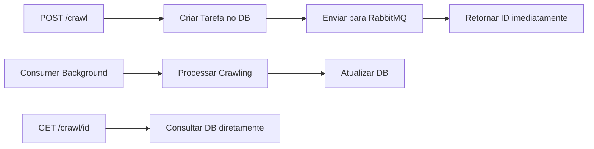

# RabbitMQ - Message Broker para Processamento Assíncrono

**Projeto:** Web Crawler API  
**Desenvolvedor:** Christian Vladimir Uhdre Mulato  

## Visão Geral

O RabbitMQ foi escolhido como message broker para implementar o processamento
assíncrono das tarefas de crawling, garantindo que a API permaneça responsiva
enquanto executa operações de longa duração em background.

## Por que RabbitMQ?

### Requisitos do Desafio que Justificam o RabbitMQ

#### 1. **Múltiplas Buscas Simultâneas (Requisito 5)**

```text
"A aplicação deve suportar a execução de múltiplas buscas simultâneas"
```

**Solução com RabbitMQ:**

- Cada busca é processada de forma independente
- Suporte nativo a múltiplos consumidores
- Garantia de isolamento entre tarefas

#### 2. **Resultados Parciais (Requisito 6)**

```text
"Resultados parciais já encontrados devem ser retornados pela operação GET"
```

**Solução com RabbitMQ:**

- Processamento não-bloqueante permite atualizações em tempo real
- API permanece responsiva durante o crawling
- Estado da tarefa é persistido no banco independentemente da fila

#### 3. **Responsividade da API (Requisito 1)**

```text
"API HTTP disponibilizada na porta 4567"
```

**Solução com RabbitMQ:**

- POST /crawl retorna imediatamente com ID da tarefa
- Processamento real acontece em background
- GET /crawl/{id} consulta estado atual sem bloqueio

## Arquitetura de Mensageria

### Componentes RabbitMQ

#### **Exchange**

```java
public static final String CRAWL_EXCHANGE = "crawl.exchange";

@Bean
public TopicExchange crawlExchange() {
    return new TopicExchange(CRAWL_EXCHANGE);
}
```

**Função:** Recebe mensagens e roteia para filas apropriadas

#### **Queue**

```java
public static final String CRAWL_QUEUE = "crawl.queue";

@Bean
public Queue crawlQueue() {
    return new Queue(CRAWL_QUEUE, true); // true = durável
}
```

**Função:** Armazena tarefas aguardando processamento

#### **Binding**

```java
public static final String CRAWL_ROUTING_KEY = "crawl.task";

@Bean
public Binding binding(Queue crawlQueue, TopicExchange crawlExchange) {
    return BindingBuilder.bind(crawlQueue).to(crawlExchange).with(CRAWL_ROUTING_KEY);
}
```

**Função:** Conecta exchange à queue com chave de roteamento

### Fluxo de Processamento



## Implementação Técnica

### 1. **Configuração RabbitMQ**

Arquivo: `src/main/java/com/mulato/api/config/RabbitConfig.java`

```java
@Configuration
public class RabbitConfig {
    
    // Constantes para identificação
    public static final String CRAWL_QUEUE = "crawl.queue";
    public static final String CRAWL_EXCHANGE = "crawl.exchange";
    public static final String CRAWL_ROUTING_KEY = "crawl.task";
    
    // Queue durável (sobrevive a reinicializações)
    @Bean
    public Queue crawlQueue() {
        return new Queue(CRAWL_QUEUE, true);
    }
    
    // Exchange do tipo Topic (permite padrões de roteamento)
    @Bean
    public TopicExchange crawlExchange() {
        return new TopicExchange(CRAWL_EXCHANGE);
    }
    
    // Binding entre exchange e queue
    @Bean
    public Binding binding(Queue crawlQueue, TopicExchange crawlExchange) {
        return BindingBuilder.bind(crawlQueue).to(crawlExchange).with(CRAWL_ROUTING_KEY);
    }
    
    // Conversor JSON para serialização automática
    @Bean
    public Jackson2JsonMessageConverter messageConverter() {
        return new Jackson2JsonMessageConverter();
    }
    
    // Template configurado para envio de mensagens
    @Bean
    public RabbitTemplate rabbitTemplate(ConnectionFactory connectionFactory) {
        RabbitTemplate template = new RabbitTemplate(connectionFactory);
        template.setMessageConverter(messageConverter());
        return template;
    }
}
```

### 2. **Produtor de Mensagens**

Arquivo: `src/main/java/com/mulato/api/service/CrawlMessageService.java`

```java
@Service
public class CrawlMessageService {
    
    @Autowired
    private RabbitTemplate rabbitTemplate;
    
    public void sendCrawlTask(CrawlTask task) {
        log.info("Sending crawl task to queue: {}", task.getId());
        
        rabbitTemplate.convertAndSend(
            RabbitConfig.CRAWL_EXCHANGE,
            RabbitConfig.CRAWL_ROUTING_KEY,
            task
        );
        
        log.info("Crawl task sent successfully: {}", task.getId());
    }
}
```

**Responsabilidades:**

- Enviar tarefas para a fila após criação no banco
- Serialização automática do objeto CrawlTask
- Logging para auditoria e debug

### 3. **Consumidor de Mensagens**

Arquivo: `src/main/java/com/mulato/api/listener/CrawlTaskListener.java`

```java
@Component
public class CrawlTaskListener {
    
    @Autowired
    private WebCrawlerService webCrawlerService;
    
    @RabbitListener(queues = RabbitConfig.CRAWL_QUEUE)
    public void processCrawlTask(CrawlTask task) {
        log.info("Received crawl task from queue: {}", task.getId());
        
        try {
            webCrawlerService.executeCrawling(task);
            log.info("Crawl task completed successfully: {}", task.getId());
        } catch (Exception e) {
            log.error("Failed to process crawl task: {}", task.getId(), e);
            // Implementar retry logic ou DLQ se necessário
        }
    }
}
```

**Responsabilidades:**

- Escutar mensagens da fila continuamente
- Deserialização automática do CrawlTask
- Delegação para o serviço de crawling
- Tratamento de erros e logging

## Vantagens da Arquitetura

### **1. Desacoplamento**

- API não depende do tempo de execução do crawling
- Processamento pode ser escalado independentemente
- Falhas no crawling não afetam a responsividade da API

### **2. Escalabilidade**

```yaml
# docker-compose.yml - Múltiplos workers
services:
  app:
    scale: 3  # 3 instâncias processando a mesma fila
```

### **3. Confiabilidade**

- **Durabilidade**: Filas sobrevivem a reinicializações
- **Acknowledgments**: Mensagens não são perdidas em falhas
- **Dead Letter Queues**: Podem ser configuradas para mensagens com erro

### **4. Monitoramento**

- **Management UI**: Interface web para monitoramento
- **Métricas**: Quantidade de mensagens, consumidores ativos
- **Logs**: Rastreamento completo do fluxo de mensagens

## Configuração de Conexão

### **Desenvolvimento Local**

```yaml
# application.yml
spring:
  rabbitmq:
    host: localhost
    port: 5672
    username: guest
    password: guest
```

### **Docker Compose**

```yaml
# docker-compose.yml
services:
  rabbitmq:
    image: rabbitmq:3-management
    ports:
      - "5672:5672"      # AMQP
      - "15672:15672"    # Management UI
    environment:
      RABBITMQ_DEFAULT_USER: guest
      RABBITMQ_DEFAULT_PASS: guest
```

### **Produção (Containerizada)**

```yaml
# application-docker.yml
spring:
  rabbitmq:
    host: rabbitmq  # Nome do serviço no Docker Compose
    port: 5672
```

## Modelo de Dados na Fila

### **CrawlTask**

```java
public class CrawlTask {
    private String id;           // ID único da tarefa
    private String keyword;      // Termo a ser buscado
    private String baseUrl;      // URL base configurada
    private LocalDateTime startTime;
    private boolean active;
    private int foundUrls;
    
    // Getters, setters, construtores
}
```

### **Serialização JSON**

```json
{
  "id": "abcd1234",
  "keyword": "security",
  "baseUrl": "http://hiring.axreng.com",
  "startTime": "2025-07-09T15:30:00",
  "active": true,
  "foundUrls": 0
}
```

## Padrões de Implementação

### **1. Producer Pattern**

```java
// Controller -> Service -> RabbitMQ
@PostMapping("/crawl")
public ResponseEntity<CrawlResponse> startCrawl(
        @Valid @RequestBody CrawlRequest request) {
    CrawlTaskEntity task = crawlService.createTask(request.getKeyword());
    crawlMessageService.sendCrawlTask(task.toModel());
    return ResponseEntity.ok(new CrawlResponse(task.getId()));
}
```

### **2. Consumer Pattern**

```java
// RabbitMQ -> Listener -> Service
@RabbitListener(queues = RabbitConfig.CRAWL_QUEUE)
public void processCrawlTask(CrawlTask task) {
    webCrawlerService.executeCrawling(task);
}
```

### **3. State Management Pattern**

```java
// Estado mantido no banco, não na fila
public CrawlResult getCrawlResult(String id) {
    // Consulta direta ao banco, independente da fila
    CrawlTaskEntity task = crawlRepository.findById(id);
    List<String> urls = crawlResultRepository.findUrlsByTaskId(id);
    return new CrawlResult(task.getId(), task.getStatus(), urls);
}
```

## Monitoramento e Observabilidade

### **RabbitMQ Management UI**

- **URL**: <http://localhost:15672>
- **Credenciais**: guest/guest
- **Funcionalidades**:
  - Visualizar filas, exchanges e bindings
  - Monitorar throughput de mensagens
  - Inspecionar mensagens pendentes
  - Estatísticas de consumo

### **Logs da Aplicação**

```java
// Logs estruturados para rastreamento
log.info("Sending crawl task to queue: {}", task.getId());
log.info("Received crawl task from queue: {}", task.getId());
log.info("Crawl task completed successfully: {}", task.getId());
log.error("Failed to process crawl task: {}", task.getId(), e);
```

### **Métricas Spring Boot Actuator**

- `/actuator/rabbitmq` - Métricas de conexões
- `/actuator/metrics` - Throughput de mensagens
- `/actuator/health` - Status da conexão RabbitMQ

## Tratamento de Erros

### **Estratégias Implementadas**

#### **1. Acknowledgments Automáticos**

```java
@RabbitListener(queues = RabbitConfig.CRAWL_QUEUE)
public void processCrawlTask(CrawlTask task) {
    // Se method completa sem exception -> ACK automático
    // Se method lança exception -> NACK automático
}
```

#### **2. Logging de Erros**

```java
try {
    webCrawlerService.executeCrawling(task);
} catch (Exception e) {
    log.error("Failed to process crawl task: {}", task.getId(), e);
    // Tarefa marcada como erro no banco
    crawlService.markAsError(task.getId(), e.getMessage());
}
```

#### **3. Estado Consistente**

- Status da tarefa sempre reflete realidade no banco
- Falhas não deixam estado inconsistente
- Timeouts configuraveis para tarefas longas

## Alternativas Consideradas

### **Por que não processamento síncrono?**

- **Bloqueio**: API ficaria travada durante crawling
- **Timeout**: Operações longas causariam timeouts HTTP
- **Concorrência**: Impossível múltiplas buscas simultâneas

### **Por que não threads simples?**

- **Persistência**: Threads não sobrevivem a reinicializações
- **Monitoramento**: Difícil observar estado das threads
- **Escalabilidade**: Limitado ao processo único

### **Por que não banco como fila?**

- **Polling**: Consultas periódicas consomem recursos
- **Concorrência**: Race conditions em múltiplos workers
- **Performance**: Banco não otimizado para mensageria

## Benefícios para os Requisitos

### **Requisito 5: Múltiplas Buscas Simultâneas**

```java
// Cada mensagem é processada independentemente
// Múltiplos consumidores podem processar em paralelo
// Estado isolado por tarefa
```

### **Requisito 6: Resultados Parciais**

```java
// GET /crawl/{id} consulta banco diretamente
// Processamento em background atualiza banco continuamente
// API sempre responsiva para consultas
```

### **Requisito 1: API HTTP Responsiva**

```java
// POST retorna imediatamente após envio para fila
// GET consulta estado atual sem bloqueio
// Processamento real em background
```

## Configuração de Desenvolvimento

### **1. Iniciar RabbitMQ Local**

```bash
# Via Docker Compose
docker-compose up -d rabbitmq

# Verificar status
docker ps | grep rabbitmq
```

### **2. Acessar Management UI**

```bash
# Abrir no navegador
open http://localhost:15672

# Credenciais: guest/guest
```

### **3. Monitorar Filas**

- **Exchanges**: Verificar `crawl.exchange`
- **Queues**: Verificar `crawl.queue`
- **Bindings**: Confirmar roteamento correto

## Troubleshooting

### **Problemas Comuns**

#### **RabbitMQ não conecta**

```bash
# Verificar se container está rodando
docker ps | grep rabbitmq

# Verificar logs do RabbitMQ
docker-compose logs rabbitmq

# Reiniciar se necessário
docker-compose restart rabbitmq
```

#### **Mensagens não são consumidas**

```java
// Verificar se @RabbitListener está ativo
// Confirmar nome da queue na anotação
// Verificar logs da aplicação para erros
```

#### **Serialização falha**

```java
// Verificar se CrawlTask é serializável
// Confirmar configuração do messageConverter
// Verificar se não há referências circulares
```

## Conclusão

O RabbitMQ foi escolhido como solução robusta e madura para atender aos
requisitos específicos do desafio, especialmente:

1. **Processamento assíncrono** para manter API responsiva
2. **Múltiplas buscas simultâneas** com isolamento garantido
3. **Resultados parciais** através de consultas não-bloqueantes
4. **Escalabilidade** para futuras expansões
5. **Confiabilidade** com durabilidade e acknowledgments

A implementação segue padrões estabelecidos da indústria e proporciona uma
base sólida para crescimento e manutenção do sistema.

---

**Desenvolvido por:** Christian Vladimir Uhdre Mulato  
**Desenvolvedor:** Christian Vladimir Uhdre Mulato  
**Data:** Campo Largo, PR, 2025
